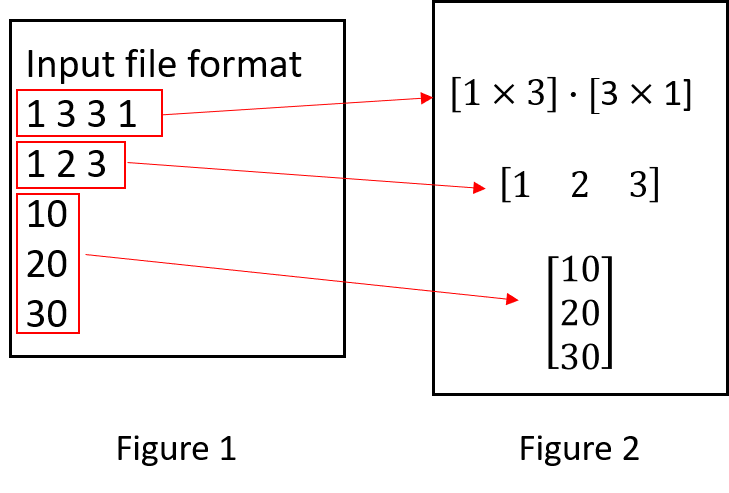

# Parallel-computing-hw01

## About The Project
In this assignment, you are to write a general matrix-matrix multiplication (MMM) program. The program executes the following procedure:
1. Ask its user to enter a filename.
2. Read the first line of the specified file. The file contains two matrices in the format specified in Figure 1, and examples in Figure 2.
3. Conduct dynamic memory allocation according to the line read in order to store the two matrices stored in the specified file.
4. Read the content of the two matrices into allocated memory.
5. Call to the function mmm (detailed later) to compute matrix-matrix product.
6. Output all results (calculation result, number of floating-point operations, and number of memory references) into another userspecified file.


<!-- Figures -->
<br />
<p align="center">
 
</p>
<br/>

## Prerequisites
* Ubuntu 
* Clang
```sh
sudo apt install clang
```

## Installation

1. Clone the repo 
```sh
git clone https://github.com/EasternGD/Parallel-computing-hw01.git
```

2. Generate the result 
```sh
make test
```

## Result
01.dat
```sh
1 3 3 1	
1 2 3
10
20
30
```
01-v1.out
```sh
c[1][1] = 
140	

Memory OP:
Read: 6 elements
write: 1 elements

Math OP:
3 additions
3 multiplications

```
## Contact

Abbey, Chen - encoref9241@gmail.com

Project Link: [Parallel-computing-hw01](https://github.com/EasternGD/Parallel-computing-hw01.git)
